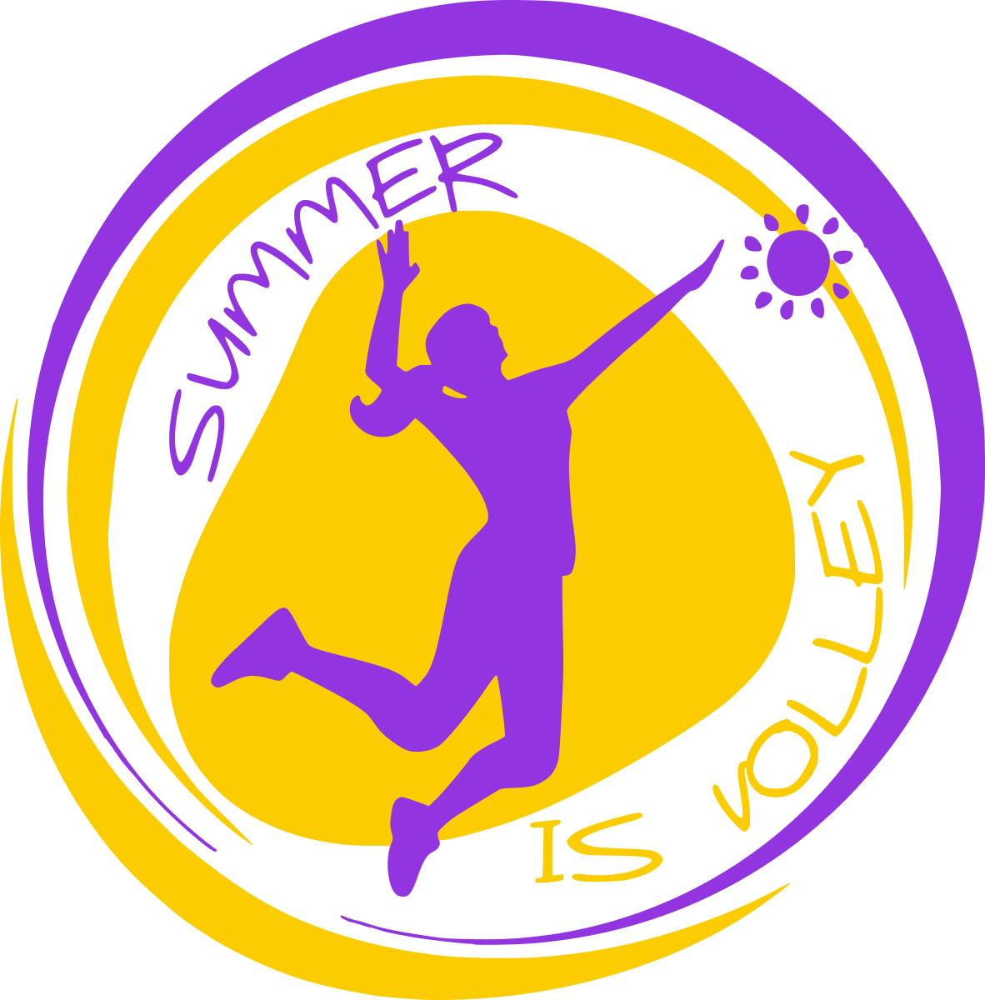

<div align="center">
  
</div>

# Summer Is Volley

Sito ufficiale del torneo **Summer Is Volley**, organizzato da **A.S.D. Iuno**.

Il progetto è una web application costruita con **Astro**, progettata per fornire ai partecipanti e agli spettatori un accesso rapido ai risultati, ai calendari e a una galleria fotografica dinamica dell'evento.

## 🚀 Caratteristiche Principali

- **Landing Page Intuitiva**: Accesso immediato alle sezioni chiave del torneo.
- **Galleria Fotografica Dinamica**: Immagini raggruppate automaticamente per data di creazione, con integrazione **PhotoSwipe** per una visualizzazione e supporto al download.
- **Integrazione Hub Esterno**: Collegamenti diretti a calendari, gironi, gare e classifiche, aggiornati in tempo reale.
- **Design Responsive**: Ottimizzato per dispositivi mobile.
- **Performance Elevate**: Ottimizzazione automatica delle immagini e compressione degli asset.
- **Sponsor Showcase**: Carosello animato per la visualizzazione dei partner dell'evento.

## 🛠️ Tech Stack

- **Framework**: [Astro v5+](https://astro.build/)
- **Styling**: [Tailwind CSS v4](https://tailwindcss.com/)
- **Librerie UI**: [PhotoSwipe](https://photoswipe.com/) per la gestione della galleria.
- **Deployment**: Docker + Nginx.

## 📂 Struttura del Progetto

```text
/
├── public/             # Asset statici pubblici
├── src/
│   ├── assets/         # Immagini, icone e gallery
│   ├── components/     # Componenti Astro riutilizzabili
│   ├── layouts/        # Layout di base della pagina
│   ├── pages/          # Rotte dell'applicazione (index, galleria, 404, 500)
│   ├── scripts/        # Script client-side (PhotoSwipe, Navigazione)
│   ├── styles/         # Stili globali CSS
│   └── consts.ts       # Costanti globali (Titolo, Descrizione)
├── Dockerfile          # Configurazione per la containerizzazione
├── nginx.conf          # Configurazione Nginx per la produzione
└── astro.config.mjs    # Configurazione di Astro
```

## ⌨️ Sviluppo Locale

### Prerequisiti

- [Node.js](https://nodejs.org/) (versione LTS consigliata)
- npm o yarn

### Installazione

```sh
# Installa le dipendenze
npm install
```

### Avvio in Sviluppo

```sh
# Avvia il server di sviluppo con hot-reload
npm run dev
```

Il sito sarà accessibile all'indirizzo `http://localhost:4321`.

### Build per la Produzione

```sh
# Genera la build statica nella cartella ./dist
npm run build
```

## 🐳 Deployment con Docker

Il progetto è pronto per essere distribuito tramite Docker:

```sh
# Build dell'immagine
docker build -t siv-website .

# Esecuzione del container
docker run -p 3000:3000 siv-website
```

L'applicazione sarà servita da Nginx sulla porta `3000`.
